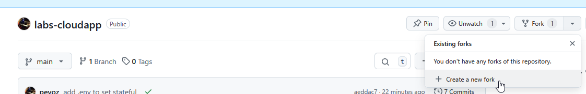
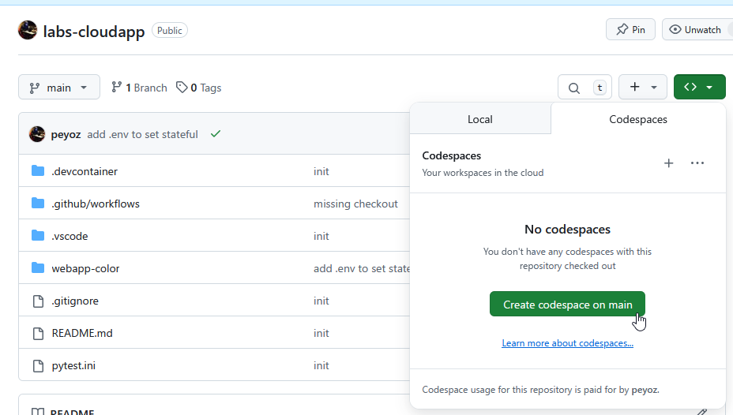
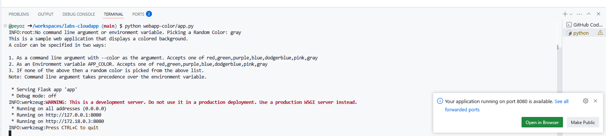
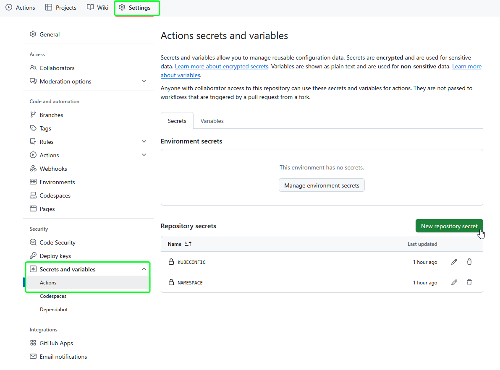
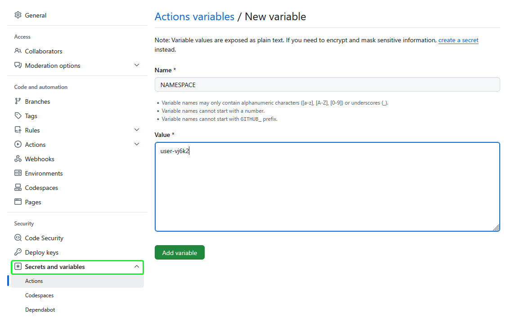

# labs-cloudapp

## Forking the Repository

1. Click the "Fork" button at the top-right corner of this repository's GitHub page.

2. Choose your GitHub account or organization where the fork will be created.
3. Open the forked repository in a GitHub Codespace:
   - Click the "Code" button and select "Create codespace on main".
   
   - Wait for the Codespace to initialize.

## Quickstart

1. Open the terminal in the Codespace:
   - Click on the "Terminal" menu and select "New Terminal".
2. Start the application:

   ```bash
   python webapp-color/app.py
   ```

3. After starting the application, a popup will appear in the lower-right corner of the Codespace pointing to your app. Click on it to open the app in your browser.


## Build and Deploy

1. Navigate to the "Settings" tab of your forked repository on GitHub.
2. Go to "Secrets and variables" > "Actions".
3. Add the required secret as __repository secrets__:
   - `KUBECONFIG`: The kubeconfig file for deploying to Kubernetes.
   
4. Add the required variable as __repository variables__:
   - `NAMESPACE`: The namespace for your Kubernetes deployment.
   
